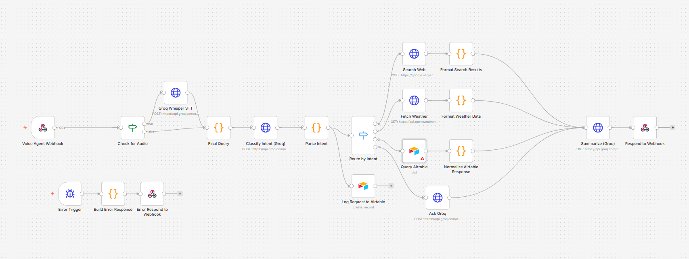

# 🎙️ Voice AI Research Assistant (v2)

A production-grade, low-latency AI voice agent built on **n8n**. It accepts voice or text input, intelligently routes queries to specialized tools (web search, weather, Airtable, or direct LLM), and returns a concise voice-friendly answer — all in the user's native language.



---

## 📑 Table of Contents

- [Features](#-features)
- [Architecture Overview](#-architecture-overview)
- [Technology Stack](#-technology-stack)
- [How It Works](#-how-it-works)
- [Getting Started](#-getting-started)
  - [Prerequisites](#1-prerequisites)
  - [n8n Workflow Setup](#2-n8n-workflow-setup)
  - [Airtable Setup](#3-airtable-setup)
  - [Frontend Setup](#4-frontend-setup)
- [API Reference](#-api-reference)
- [Configuration Reference](#-configuration-reference)
- [Project Structure](#-project-structure)
- [Error Handling](#-error-handling)
- [Multilingual Support](#-multilingual-support)
- [Known Limitations & Improvements](#-known-limitations--improvements)
- [License](#-license)

---

## ✨ Features

| Feature | Details |
| :--- | :--- |
| **Dual-Mode Input** | Accepts raw text via JSON body OR audio files (`audio/webm`, `audio/ogg`, `audio/mp4`) via multipart form-data |
| **Near-Instant STT** | Groq Whisper `whisper-large-v3-turbo` transcribes audio in under a second |
| **Multilingual** | Detects browser language (e.g. `en`, `es`, `fr`) and responds in the same language automatically |
| **Smart Intent Routing** | Llama 3.3 70B classifies each query and dispatches to the right tool |
| **Web Research** | Top 5 Google results via Serper.dev, summarized by LLM |
| **Live Weather** | Real-time conditions via OpenWeatherMap |
| **Airtable Integration** | Query your structured data and log every session automatically |
| **Text-to-Speech** | Browser-native Web Speech API speaks the assistant's reply aloud |
| **Fault Tolerance** | Dedicated Error Trigger node catches failures and returns a graceful fallback response |

---

## 🏗️ Architecture Overview

```
POST /voice-agent
       │
       ▼
┌──────────────┐
│ Check Audio? │──── YES ──► Groq Whisper STT ──┐
└──────────────┘                                  │
       │ NO                                        │
       └──────────────────────────────────────────►│
                                                   ▼
                                           ┌──────────────┐
                                           │  Final Query │
                                           └──────┬───────┘
                                                  │
                                                  ▼
                                     ┌────────────────────────┐
                                     │  Classify Intent (LLM) │
                                     └────────────┬───────────┘
                                                  │
                                     ┌────────────▼───────────┐
                                     │     Route by Intent    │
                                     └──┬──────┬──────┬───┬───┘
                                        │      │      │   │
                                   research weather data gen
                                        │      │      │   │
                                       Web  Weather Airtable LLM
                                      Search  API    Query Direct
                                        │      │      │   │
                                        └──────┴──────┴───┘
                                                  │
                                                  ▼
                                        ┌─────────────────┐
                                        │ Summarize (LLM) │
                                        └────────┬────────┘
                                                 │
                                  ┌──────────────┴───────────────┐
                                  ▼                               ▼
                          Respond to Webhook         Log Request to Airtable
```

---

## 🛠️ Technology Stack

| Layer | Component | Purpose |
| :--- | :--- | :--- |
| **Orchestration** | [n8n](https://n8n.io/) | Self-hosted low-code workflow engine |
| **Voice Engine** | [Groq Whisper v3 Turbo](https://groq.com/) | Near-real-time Speech-to-Text |
| **LLM** | [Llama 3.3 70B](https://groq.com/) | Intent classification & answer summarization |
| **Search** | [Serper.dev](https://serper.dev/) | High-speed Google Search results |
| **Weather** | [OpenWeatherMap](https://openweathermap.org/) | Current conditions & forecasts |
| **Database** | [Airtable](https://airtable.com/) | Structured data queries & session logging |
| **Frontend TTS** | Web Speech API | Reads responses aloud in the browser |

---

## ⚙️ How It Works

### 1. Ingestion
A `POST` request hits the `/voice-agent` webhook. The first node checks whether the request body contains a binary audio attachment.

### 2. Transcription or Text Extraction
- **Audio path**: The file is sent to Groq Whisper (`whisper-large-v3-turbo`) and transcribed in near real-time.
- **Text path**: The query is extracted directly from `body.query` or `body.text`.

Both paths converge at the **Final Query** code node, which also picks up the user's `language` from the request.

### 3. Intent Classification
The query text is sent to **Llama 3.3 70B** with a strict system prompt. The model replies with exactly one of four labels:

| Label | Triggers |
| :--- | :--- |
| `research` | Academic, news, or general web searches |
| `weather` | Any request about current or forecast weather |
| `data_query` | Questions that should be answered from Airtable records |
| `general_question` | Conversational or light Q&A — answered directly by the LLM |

### 4. Execution Branch
The **Route by Intent** switch node dispatches the request:
- **Research** → Serper.dev fetches the top 5 Google results → formatted into a clean object.
- **Weather** → OpenWeatherMap returns temperature, conditions, humidity, and wind speed.
- **Data Query** → Airtable list operation returns matching records.
- **General** → Llama 3.3 directly answers the question in 2–3 sentences.

### 5. Parallel Logging
At the same time as routing, every request is logged to an Airtable table (`VoiceLogs`) with: SessionID, Query, Intent, Language, and Timestamp.

### 6. Summarization
All branch outputs (except General, which is already concise) flow into a single **Summarize (Groq)** node. It uses Llama 3.3 to convert raw data into a 2–3 sentence voice-friendly summary in the user's language.

### 7. Response
The webhook responds with:
```json
{
  "response": "The assistant's spoken answer.",
  "transcribed_text": "What the user said (if voice input).",
  "timestamp": "2026-03-19T10:00:00.000Z"
}
```

---

## 🚀 Getting Started

### 1. Prerequisites

You will need accounts and API keys for the following services:

| Service | What you need | Where to get it |
| :--- | :--- | :--- |
| [Groq](https://console.groq.com/) | API Key | Console → API Keys |
| [Serper.dev](https://serper.dev/) | API Key | Dashboard → API Key |
| [OpenWeatherMap](https://openweathermap.org/api) | API Key | Account → API Keys |
| [Airtable](https://airtable.com/) | Personal Access Token + Base/Table IDs | Account → Developer Hub |
| [n8n](https://n8n.io/) | Self-hosted or cloud instance | n8n.io |

---

### 2. n8n Workflow Setup

**Step 1 — Import the workflow**
1. Open your n8n instance.
2. Go to **Workflows → Import from File**.
3. Select `Voice-AI-Research-Assistant.json`.

**Step 2 — Replace all placeholder values**

Search for and replace every placeholder in the imported workflow:

| Placeholder | Replace with |
| :--- | :--- |
| `YOUR_GROQ_API_KEY` | Your Groq API key (appears in 4 nodes) |
| `YOUR_SERPER_API_KEY` | Your Serper.dev API key |
| `YOUR_OPENWEATHERMAP_API_KEY` | Your OpenWeatherMap API key |
| `YOUR_AIRTABLE_APP_ID` | The base ID of your Airtable data base (starts with `app`) |
| `YOUR_AIRTABLE_TABLE_ID` | The table ID for data queries (starts with `tbl`) |
| `YOUR_AIRTABLE_LOG_APP_ID` | The base ID of your Airtable logging base |
| `YOUR_AIRTABLE_VOICELOGS_TABLE_ID` | The table ID for session logs |
| `YOUR_AIRTABLE_CRED_ID` | Your Airtable credential ID inside n8n |
| `YOUR_WEBHOOK_ID` | Auto-generated by n8n after import — leave as-is |

> 💡 **Tip**: In n8n, open each HTTP Request node → Headers → and update the `Authorization` value.

**Step 3 — Configure the weather node**

In the **Fetch Weather** node, the URL contains a hardcoded `CITY_NAME`. For a production setup, replace this with a dynamic expression that extracts the city from the user's query (e.g., using a regex or an additional LLM call to extract the location entity).

For a quick test, hardcode a city:
```
https://api.openweathermap.org/data/2.5/weather?q=London&appid=YOUR_KEY&units=metric
```

**Step 4 — Activate the workflow**

Toggle the workflow to **Active**. The webhook will be live at:
```
https://your-n8n-instance.com/webhook/voice-agent
```

For testing before activating, use the test URL:
```
https://your-n8n-instance.com/webhook-test/voice-agent
```

---

### 3. Airtable Setup

You need **two** Airtable tables:

#### Data Table (for `data_query` intent)
Create a base with whatever fields your use case needs. The workflow lists all records and passes them to the LLM for summarization.

#### VoiceLogs Table (for session logging)
Create a table with these exact column names:

| Column Name | Field Type |
| :--- | :--- |
| `SessionID` | Single line text |
| `Query` | Long text |
| `Intent` | Single line text |
| `Language` | Single line text |
| `Timestamp` | Single line text |

---

### 4. Frontend Setup

1. Open `voice_frontend.html` in a text editor.
2. Find this line near the bottom of the `<script>` block:
   ```javascript
   const N8N_URL = 'http://localhost:5678/webhook-test/voice-agent';
   ```
3. Replace it with your n8n webhook URL:
   - **Testing**: use `webhook-test/voice-agent`
   - **Production**: use `webhook/voice-agent`
4. Open the HTML file in a browser. Allow microphone access when prompted.
5. Click the microphone button, speak your query, and click again to stop recording.

> ⚠️ **HTTPS required for microphone access**: If deploying this to a remote server, serve the HTML over HTTPS or the browser will block microphone access. You can use ngrok, Cloudflare Tunnel, or a standard HTTPS server.

---

## 📡 API Reference

### Endpoint

```
POST /webhook/voice-agent
```

### Voice Input (multipart/form-data)

| Field | Type | Required | Description |
| :--- | :--- | :--- | :--- |
| `data` | File | Yes | Audio file (`audio/webm`, `audio/ogg`, `audio/mp4`) |
| `language` | String | No | BCP 47 language code (e.g. `en`, `es`). Defaults to `en`. |
| `session_id` | String | No | Your session identifier for logging. Defaults to `"default"`. |

### Text Input (application/json)

```json
{
  "query": "What is the capital of France?",
  "language": "en",
  "session_id": "user-abc-123"
}
```

### Response

```json
{
  "response": "The capital of France is Paris, a city known for the Eiffel Tower.",
  "transcribed_text": "What is the capital of France?",
  "timestamp": "2026-03-19T10:30:00.000Z"
}
```

### Error Response

```json
{
  "response": "I am sorry, I encountered an error processing your request.",
  "transcribed_text": "",
  "error": true,
  "timestamp": "2026-03-19T10:30:00.000Z"
}
```

---

## ⚙️ Configuration Reference

| Node | Key Parameter | Default | Notes |
| :--- | :--- | :--- | :--- |
| Groq Whisper STT | `model` | `whisper-large-v3-turbo` | Can switch to `whisper-large-v3` for higher accuracy |
| Classify Intent | `temperature` | `0.1` | Keep low for deterministic classification |
| Ask Groq (General) | `temperature` | `0.3` | Slight creativity for conversational replies |
| Summarize (Groq) | `temperature` | `0.4` | Balanced between factual and natural-sounding |
| Search Web | `num` | `5` | Number of search results to fetch (max 10 on free Serper tier) |
| Fetch Weather | `units` | `metric` | Change to `imperial` for Fahrenheit |

---

## 📁 Project Structure

```
voice-ai-research-assistant/
├── Voice-AI-Research-Assistant.json  # n8n workflow (import this)
├── voice_frontend.html               # Browser-based frontend UI
├── workflow.png                      # Architecture diagram (optional)
├── README.md                         # This file
└── LICENSE                           # MIT License
```

---

## 🛡️ Error Handling

The workflow uses n8n's built-in **Error Trigger** node as a global catch-all:

1. Any node that fails (API timeout, bad response, etc.) is set with `continueOnFail: true`, so the workflow doesn't crash hard.
2. If a fatal error does bubble up, the **Error Trigger** node catches it and routes to **Build Error Response**, which logs the failed node name and error message.
3. **Error Respond to Webhook** returns a `200 OK` with `"error": true` in the body, so the frontend can display a graceful fallback message instead of hanging.

> 🔍 To debug, check the **Build Error Response** node output — it includes `failed_node` and `error_detail` fields.

---

## 🌍 Multilingual Support

Language detection happens at two points:

1. **Frontend**: `navigator.language` is sent as the `language` field (e.g. `"es"` for Spanish).
2. **Whisper STT**: The `language` field is passed directly to Whisper for more accurate transcription in non-English languages.
3. **Summarization**: The system prompt instructs the LLM to respond in the detected language.

**Currently supported languages**: Any language supported by Whisper v3 and Llama 3.3 70B (covers 50+ languages including Spanish, French, German, Arabic, Chinese, Japanese, and more).

---

## ⚠️ Known Limitations & Suggested Improvements

| Limitation | Suggested Fix |
| :--- | :--- |
| Weather node uses a hardcoded city | Add an LLM node to extract location entities from the query before calling OpenWeatherMap |
| No conversation history | Store previous turns in Airtable or a session object and pass them as message history to Groq |
| Airtable data query ignores the actual question | Add a filter or pass the query to the LLM to select relevant records before summarizing |
| Frontend lacks session persistence | Generate and store a UUID in `localStorage` for the `session_id` |
| No rate limiting on the webhook | Add n8n's rate-limit middleware or an API gateway (e.g. Kong, Cloudflare) in front |
| TTS uses browser default voice | Integrate a dedicated TTS API (e.g. ElevenLabs, OpenAI TTS) for higher-quality audio output |

---

## 📄 License

This project is licensed under the **MIT License** — see the [LICENSE](LICENSE) file for full details.

Built by **M Wajeeh Ul Hassan**. Use it as a foundation for your own AI voice agents and extend freely!
