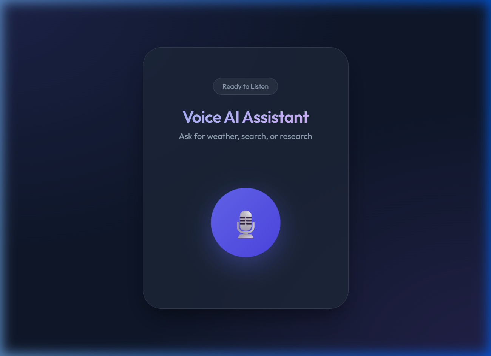

# 🎙️ Voice AI Research Assistant

A sophisticated, low-latency AI agent built on **n8n**. This assistant seamlessly handles both voice and text queries, employing advanced logic for intent classification, web research, real-time data retrieval, and concise summarization.

---

## ✨ Key Features

- **Dual-Mode Input**: Supports raw text via JSON bodies and voice recordings (audio files) via multipart/form-data.
- **Instant Transcription**: Uses Groq-powered Whisper (`whisper-large-v3-turbo`) for near-instant STT (Speech-to-Text).
- **Intelligent Routing**: Dynamically classifies intent into four specialized pipelines:
  - 🔍 **Academic/Web Research**: Deep dives using Serper/Google Search.
  - 🌤️ **Real-time Weather**: Live updates via OpenWeatherMap API.
  - 📊 **Database Queries**: Structured data retrieval from Airtable.
  - 💡 **General Knowledge**: Direct interaction with Llama 3.3.
- **Concise Summarization**: Aggregates data from multiple sources and summarizes findings into 2-3 punchy sentences.
- **Privacy First**: Designed with modular architecture, allowing easy replacement of API keys and instance-specific IDs.
- **Premium Interface**: Includes a beautifully designed `voice_frontend.html` for immediate interaction.

---

## 🎨 Voice Frontend Interface

The project includes a standalone HTML interface (`voice_frontend.html`) that allows you to interact with your n8n workflow using your microphone.

### Features:
- **Visual Feedback**: Real-time recording indicators and voice visualizers.
- **Instant Response**: Displays both your transcription and the assistant's response.
- **Text-to-Speech**: Automatically speaks the assistant's response.

### Setup:
1.  Open `voice_frontend.html` in any modern web browser.
2.  In the `<script>` section, update the `N8N_URL` variable with your n8n Webhook URL.
3.  Click the microphone icon and start talking!

---

## 🛠️ Technology Stack

| Component | Technology |
| :--- | :--- |
| **Engine** | [n8n](https://n8n.io/) |
| **STT (Voice)** | [Groq Whisper Large V3 Turbo](https://groq.com/) |
| **LLM (Logic/Summarization)** | [Llama 3.3 70B Versatile](https://groq.com/) |
| **Search API** | [Serper.dev](https://serper.dev/) |
| **Weather API** | [OpenWeatherMap](https://openweathermap.org/) |
| **Database** | [Airtable](https://airtable.com/) |

---

## ⚙️ Workflow Logic

The assistant follows a robust execution path:

1.  **Ingestion**: Receives a `POST` request at `/voice-agent`.
2.  **Detection**: Checks for binary audio. If present, it's transcribed via Groq; otherwise, it extracts the `query` from the JSON body.
3.  **Classification**: Llama 3.3 analyzes the query and routes it to the most relevant branch.
4.  **Processing**:
    - *Research*: Fetches the top 5 organic search results.
    - *Weather*: Retrieves temperature, conditions, and wind speed for the target city.
    - *Data Query*: Pulls matching records from Airtable.
    - *General*: Direct LLM inference.
5.  **Normalization**: Custom JavaScript nodes format results from different APIs into a unified JSON structure.
6.  **Summarization**: A final pass through Llama 3.3 transforms raw data into a human-friendly voice-ready response.
7.  **Response**: Returns a JSON payload with the final answer and a timestamp.

---

## 🚀 Getting Started

### Prerequisites

You will need the following API keys:
- **Groq API Key**: For transcription and LLM logic.
- **Serper API Key**: For web research.
- **OpenWeatherMap API Key**: For weather data.
- **Airtable Token**: (Optional) For internal database queries.

### Setup Instructions

1.  Download the `Voice-AI-Research-Assistant.json` file.
2.  Import the JSON into your [n8n instance](https://docs.n8n.io/getting-started/installation/).
3.  Open the nodes and replace the placeholder values (`YOUR_API_KEY`, `YOUR_ID`, etc.) with your actual credentials.
4.  Configure your Webhook node and ensure the path is set to `voice-agent`.
5.  Activate the workflow!

---

## 📄 License
MIT License. Feel free to use and modify for your own projects.
